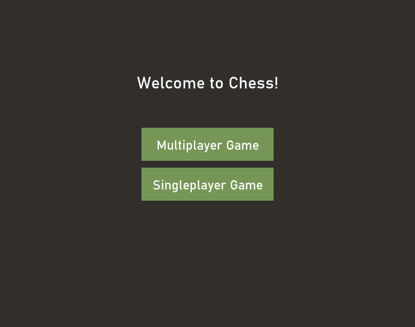
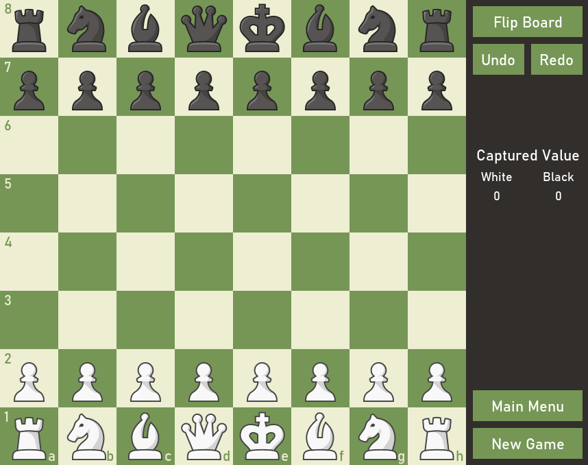
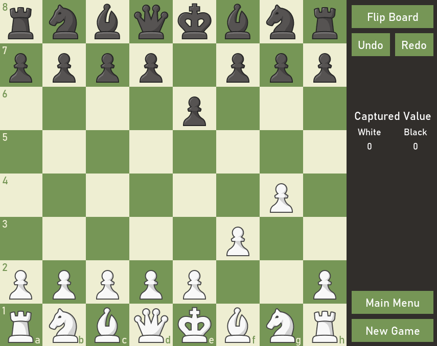
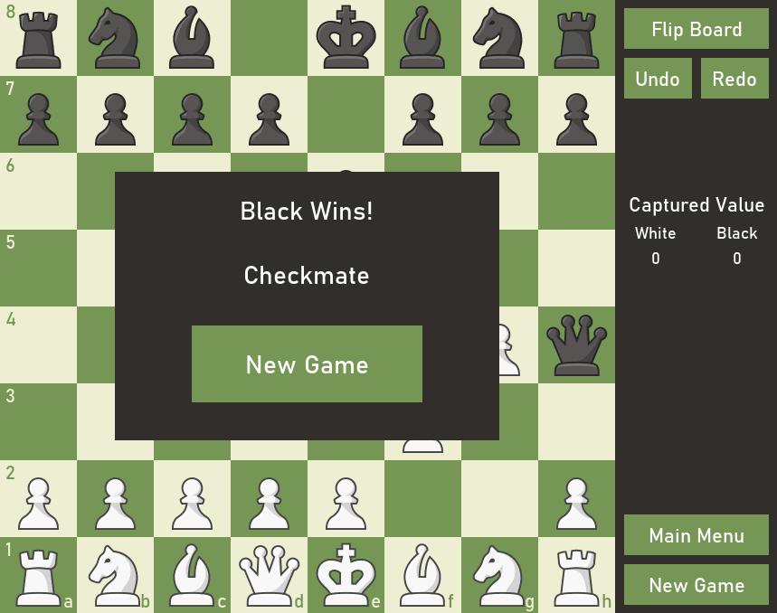
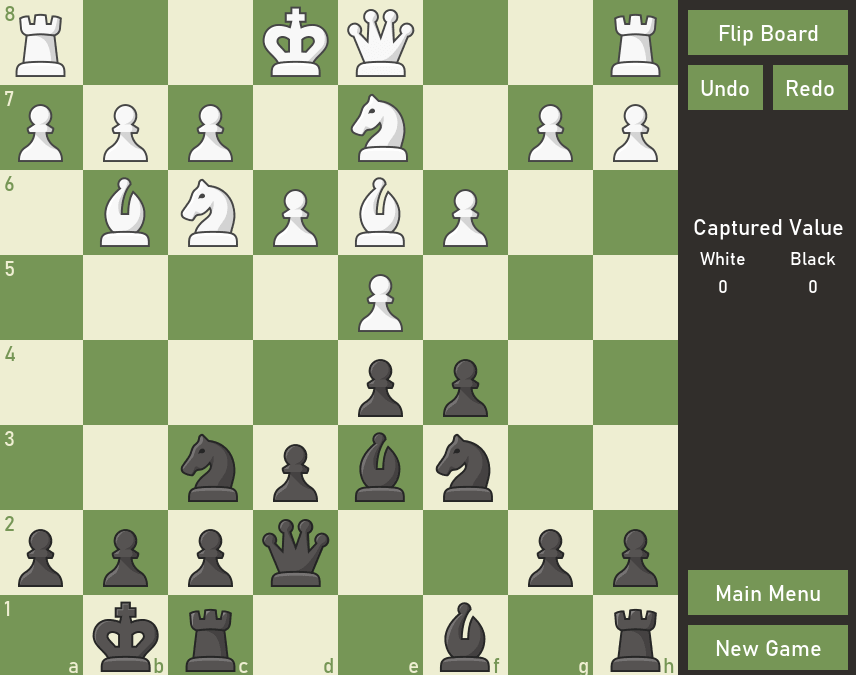
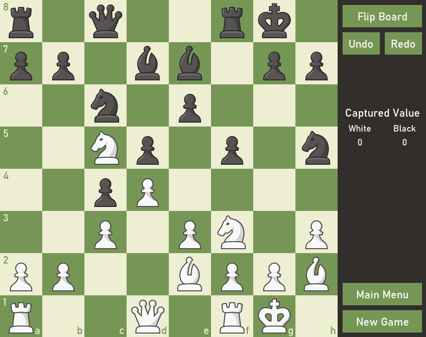
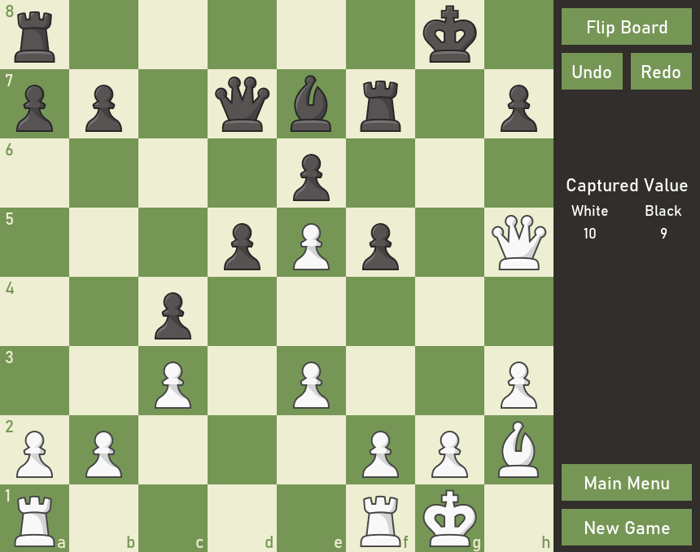
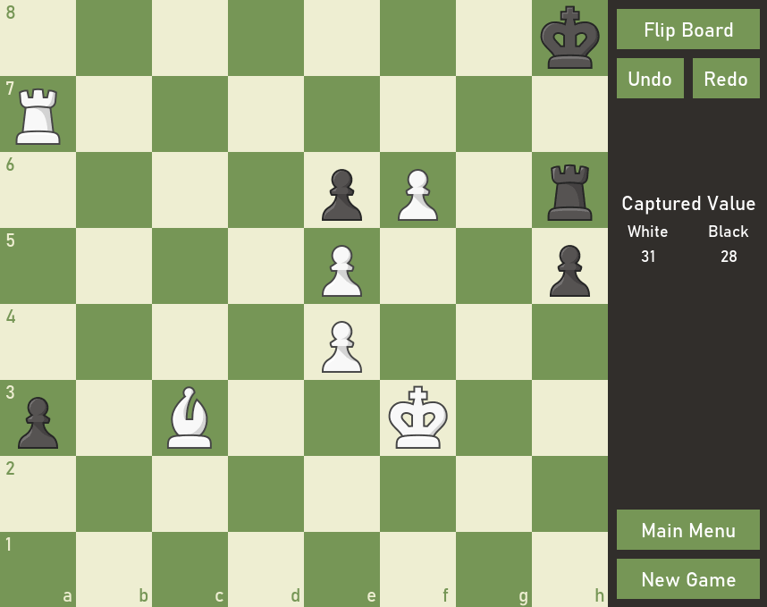

# chess
This application features singleplayer and multiplayer chess powered by the python chess library and pygame.  The AI for singleplayer chess uses minimax with alpha-beta pruning and a depth set to 4.  Additionally, the first ten moves are made using a openings database containing 43,900 games.

Application Screenshots:  
Menu  
  

New Game  
  

Checkmate  
  
  

Flip Board  
  

Example Game: Vepkhvishvili v. Swiecki (1989)  
  
  
  

